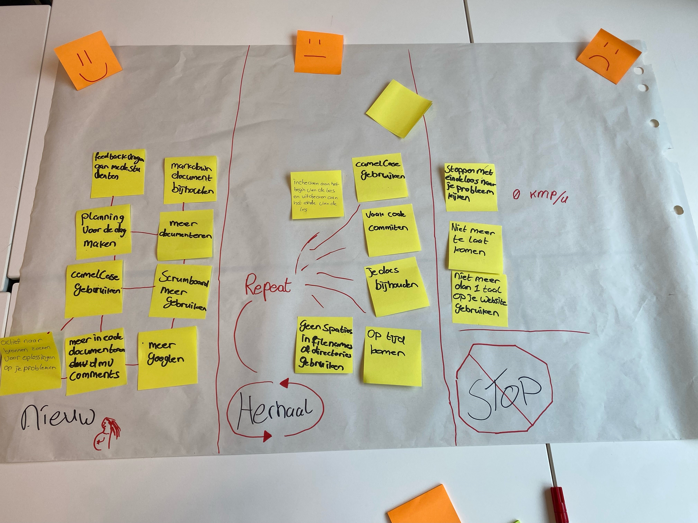

# retro spective

### -nieuw

-   Meer documenteren: Ik moet meer gaan documenteren wat ik die dag heb gedaan of bij code neerzetten wat ik heb gedaan.

-Planning voor de dag maken: Het zou handiger zijn om een planning te maken voor wat ik voor de dag zal maken.

### - Herhaal

-   Vaak code comitten: Ik commit me code vaak als ik een verandering maak aan me pagina.

-   vragen stellen: Ik stel veel vragen, en zal daar verder mee gaan zodat ik meer leer.

-   Op tijd komen: Moet zoals gewoonlijk optijd komen zodat ik geen belangrijke informatie mis.

### - Stop

-   Niet aan meerdere issues tegelijk werken: Hierdoor wordt het lastig om op 1 ding te focussen en komt er vertraging.

-   Niet meer dan 1 taal gebruiken: Dit deed ik even aan het begin, maar ik heb mezelf hier snel op gecorriceerd dat ik alleen nederlands gebruik.

# Gedragscriteria

-G1: Ik neem verantwoordelijkheid voor mijn eigen werk. Zo zal ik het accepteren als ik me werk niet af heb als ik bijvoorbeeld zit te luieren.

-G2: Ik ben goed met feedback ontvangen en geven aan medestudenten. Zo heb ik al meerdere studenten geholpen hoe ze een probleem moeten aanpakken of dat ze niet op die manier moeten werken. Als ik feedback ontvang denk ik goed na hoe ik mijzelf dan kan verbeteren en hoe ik het met die feedback zal gaan aanpakken.

-G3: Ik heb gewerkt met de ontwikkelomgeving van ICT

-G5: Ik communiceer op een professionele manier met de mede student en docenten.

-G8: Ik bespreek mijn motivatie door bij het inchecken mijn plannen te zetten en vervolgens ook na mijn woorden na te leven.
